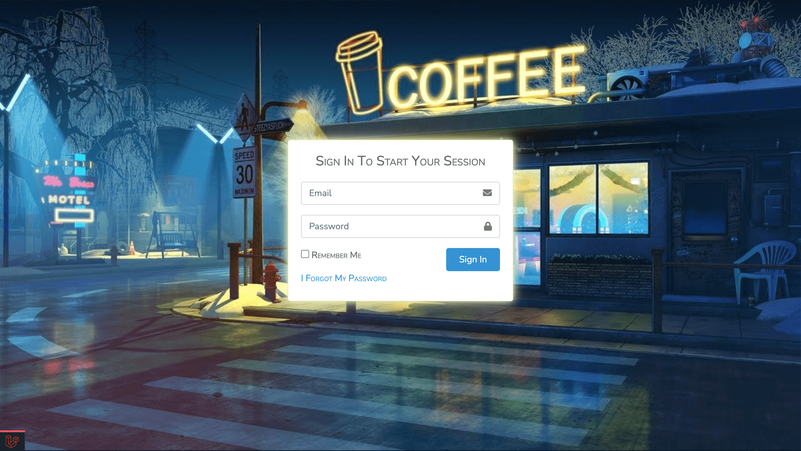
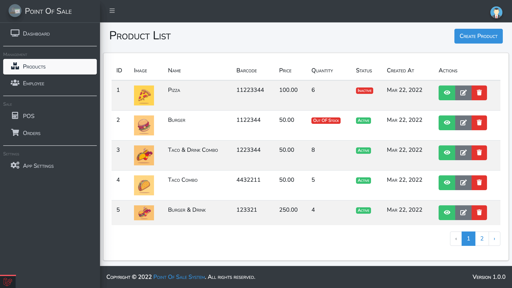
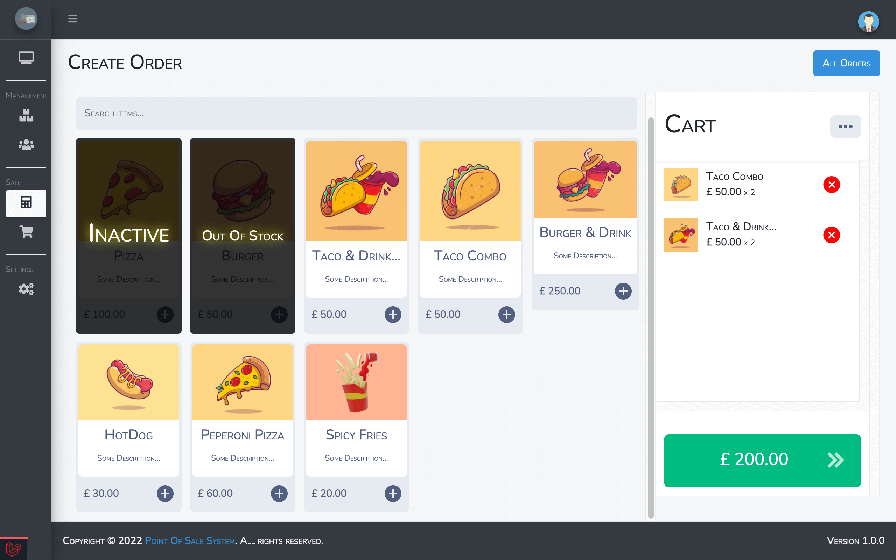
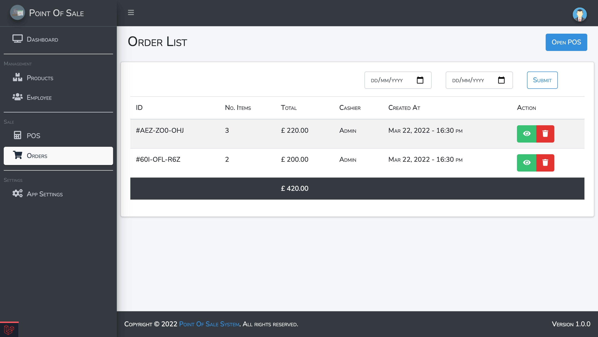
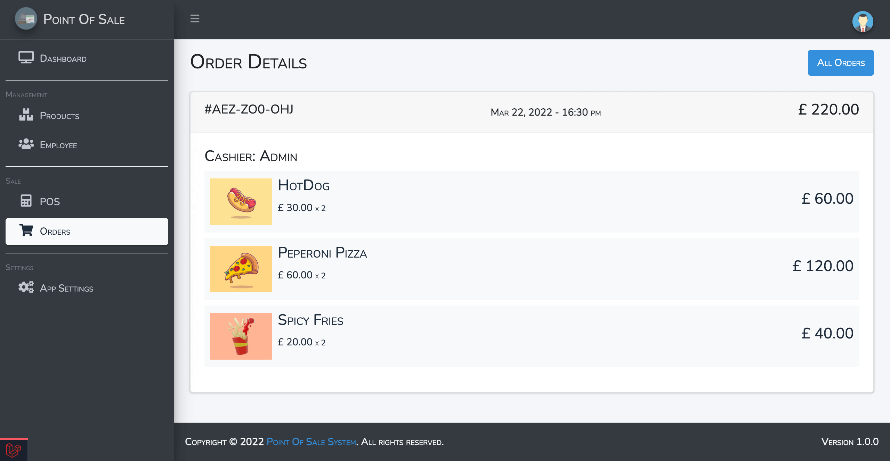

    <h1 style="margin: 0; padding: 0">Point Of Sale System</h1>
    <h2 style="margin: 0; padding: 0">Using Laravel</h2>

    <figure style="padding: 0; margin: 0">
      
      <figcaption>Fig.1 - Login Page.</figcaption>
    </figure>
    <figure style="padding: 0; margin: 0">
      
      <figcaption>Fig.2 - Dashboard.</figcaption>
    </figure>
    <figure style="padding: 0; margin: 0">
      
      <figcaption>Fig.3 - Inventory Page.</figcaption>
    </figure>
    <figure style="padding: 0; margin: 0">
      
      <figcaption>Fig.4 - POS Interface.</figcaption>
    </figure>
    <figure style="padding: 0; margin: 0">
      
      <figcaption>Fig.5 - All Orders.</figcaption>
    </figure>
    <figure style="padding: 0; margin: 0">
      
      <figcaption>Fig.6 - Order Details.</figcaption>
    </figure>

